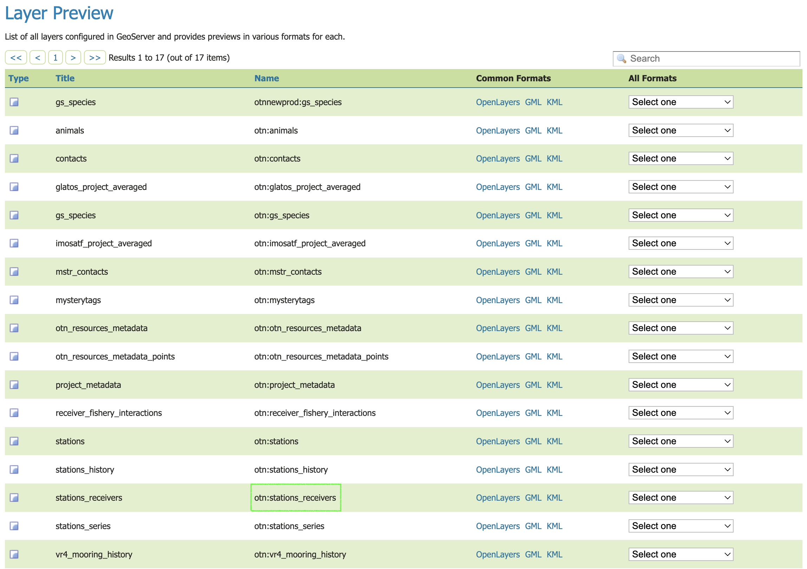
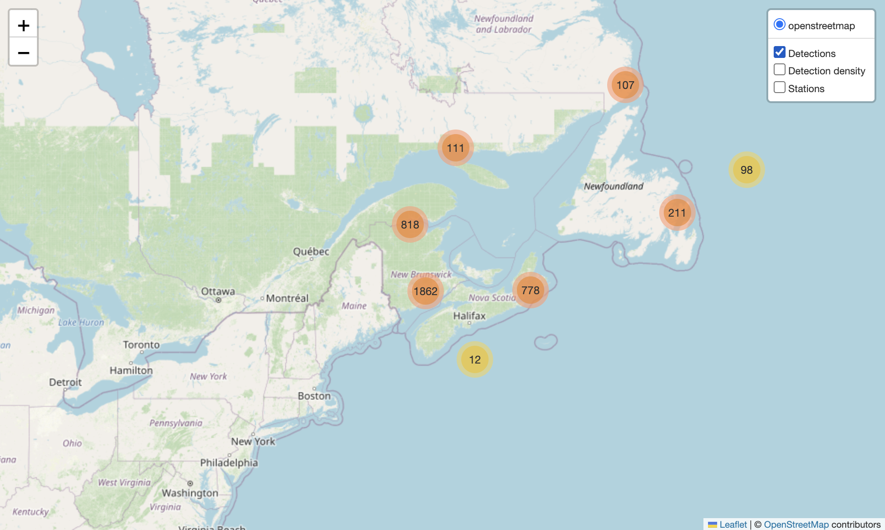
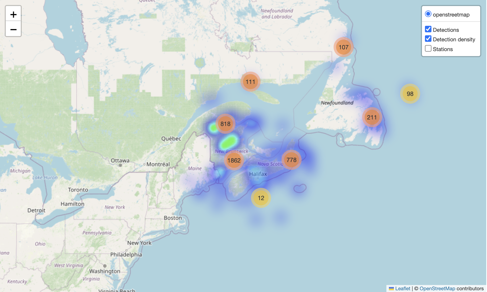
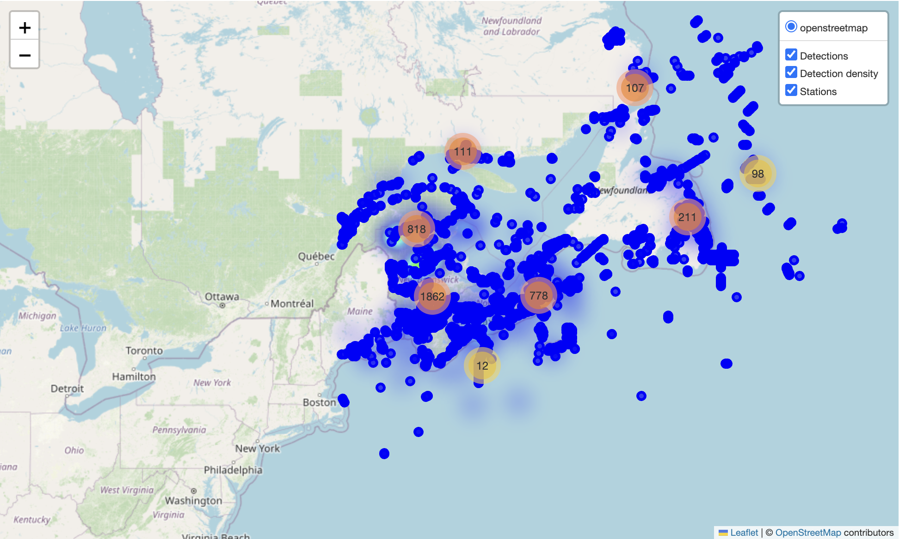

## What is GeoServer?

GeoServer is an open-source server that implements OGC standards for sharing spatial data. It can deliver vector features via WFS, map images via WMS, and raster coverages via WCS.

At OTN, GeoServer is used to publish infrastructure layers such as station and receiver deployments, mooring sites, and project footprints. These layers support tasks like plotting receiver locations, filtering detections by location, and integrating OTN data into GIS workflows.

For reproducible analysis, this lesson focuses on WFS because it returns tabular and spatial formats that R and Python can read directly.

## GeoServer Layer Definitions

OTN publishes multiple spatial layers through its GeoServer service.
These layers describe network infrastructure, metadata, and partner data products.
Descriptions below are summarized from the [OTN Publication Information page](https://members.oceantrack.org/data/publication-information).

`otn:animals`: A history of deployed tags and which species to which they were attached.

`otn:contacts`: Contact information and project associations for all affiliated OTN partners.

`otn:glatos_project_averaged`: Average location coordinates for GLATOS projects, showing one representative point per project.

`otn:gs_species`: Species listed by project, with scientific/common names, collaboration type, record totals, and AphiaID.

`otnnewprod:gs_species`: Species listed by project, with scientific/common names, collaboration type, record totals, and AphiaID.

`otn:imosatf_project_averaged`: Average coordinates for IMOS ATF projects, giving one centroid point per project.

`otn:mstr_contacts`: Contact records for project contributors, including names, roles, affiliation, email, ORCID, and project association.

`otn:mysterytags`: Unidentified tag detections by region and year, listing tag IDs and associated detection counts.

`otn:otn_resources_metadata`: Project-level metadata with project names, descriptions, status, locality, collaboration type, citation, website, and project footprint polygons.

`otn:otn_resources_metadata_points`: Project metadata represented as point features, including project names, status, collaboration type, total records, and project footprint polygons.

`otn:project_metadata`: A listing of each OTN and partner-affiliated project.

`otn:receiver_fishery_interactions`: Records of receiver deployment outcomes where gear was lost, failed, or moved, including station details, dates, instrument type, and notes on recovery or failure.

`otn:stations`: A list of all the locations at which there have been receivers deployed.

`otn:stations_history`: A list of all receiver deployments, along with any user-submitted 'proposed' instrument deployments, with future-dated deployments and status of 'proposed'.

`otn:stations_receivers`: Receiver deployment records with station name, location, model, deployment and recovery dates, depth, offset, download history, and receiver status.

`otn:stations_series`: A list of all the receiver deployments OTN is aware of, with locations, instrument serial number, start and end dates, and project affiliation.

`otn:vr4_mooring_history`: Deployment and recovery history for VR4 moorings, including coordinates, dates, last downloads, and principal investigator details.

## Anatomy of a WFS GetFeature request

A WFS `GetFeature` request is a URL composed of key–value parameters.

~~~
https://members.oceantrack.org/geoserver/otn/ows?
service=WFS&
version=1.0.0&
request=GetFeature&
typeName=otn:stations_receivers&
outputFormat=csv
~~~
{: .language-text}

**Parameters**

| Parameter      | Example                                             | Purpose                                                      |
| -------------- | --------------------------------------------------- | ------------------------------------------------------------ |
| Base endpoint  | `https://members.oceantrack.org/geoserver/otn/ows?` | GeoServer OWS endpoint                                       |
| `service`      | `WFS`                                               | Service type                                                 |
| `version`      | `1.0.0`                                             | WFS version                                                  |
| `request`      | `GetFeature`                                        | Operation to fetch vector features                           |
| `typeName`     | `otn:stations_receivers`                            | Layer name (workspace:name)                                  |
| `outputFormat` | `csv`                                               | Output format (e.g., `csv`, `application/json`, `SHAPE-ZIP`) |

**Optional filters**

~~~
&bbox=-70,40,-40,60,EPSG:4326
~~~
{: .language-text}

Restricts results to a bounding box (minLon, minLat, maxLon, maxLat, CRS).

~~~
&cql_filter=collectioncode='MAST'
~~~
{: .language-text}

Filters by attribute values using CQL.

**Filtering by Bounds (Spatial and Temporal)**

For many projects, you’ll want to narrow your results to a specific study area and time window. This can be done directly in the WFS request using a `bbox=` parameter, or after downloading the layer in R or Python. The simplest WFS form is:

```
&bbox=minLon,minLat,maxLon,maxLat,EPSG:4326
```

For example:

```
&bbox=-70,40,-40,60,EPSG:4326
```

In some workflows, especially when combining receiver deployments with detections or project timelines, it’s useful to filter data after download instead. Naomi Tress provides an example of this approach: she defines project latitude/longitude limits, sets start and end dates, then filters the full `stations_receivers` layer by deployment and recovery dates. Receivers with no reported recovery date can also be kept if they are likely still active, using expected lifespans for different receiver models (e.g., VR2W, VR3, VR4). After the temporal filtering, latitude and longitude are used to keep only receivers inside the study bounds.

This method offers precise control over which receivers were active in your region during the period of interest, and complements the simpler server-side `bbox=` filter.




The GeoServer catalog at geoserver.oceantrack.org lets you browse layers (e.g., stations, receivers, animals, project footprints) and download data in formats such as CSV, GeoJSON, or Shapefile. By default, downloads are limited to 50 features; increase the limit by adding a parameter such as `&maxFeatures=50000`. For reproducible workflows, build a WFS request URL and load the data programmatically in R or Python.


# Accessing OTN GeoServer Data

## Example: Receivers Layer in R

Before we can use spatial layers in analysis, we first need to **build the WFS request** and then **read the results into R**. Here’s how:

```r
# If needed, first install:
# install.packages("readr")

library(readr)

# 1) Define WFS URL (CSV output)
# This is the "request URL" that tells GeoServer what we want.
# Here: the `otn:stations_receivers` layer in CSV format.
wfs_csv <- "https://members.oceantrack.org/geoserver/otn/ows?
service=WFS&version=1.0.0&request=GetFeature&
typeName=otn:stations_receivers&outputFormat=csv"

# 2) Download directly into a data frame
# R will fetch the URL and treat the result as a CSV.
receivers <- read_csv(wfs_csv, guess_max = 50000, show_col_types = FALSE)

# 3) Preview first rows
print(head(receivers, 5))
```

## Example: Receivers Layer in Python

The same workflow works in Python: **construct the URL, download it, read into a DataFrame.**

```python
# If needed, first install:
# pip install pandas

import pandas as pd

# 1) Define WFS URL (CSV output)
# Same request as above, but written in Python.
wfs_csv = (
    "https://members.oceantrack.org/geoserver/otn/ows?"
    "service=WFS&version=1.0.0&request=GetFeature&"
    "typeName=otn:stations_receivers&outputFormat=csv"
)

# 2) Read CSV into DataFrame
receivers = pd.read_csv(wfs_csv)

# 3) Preview first rows
print(receivers.head())
```

## Follow Along: Filtering OTN Receivers in R

Sometimes you only need receivers that were active during a certain time window and inside your study region.
Here’s a short example showing how to define those bounds, download the layer once, and filter it.

### Define study window and region

```r
library(tidyverse)
library(lubridate)

study_start <- ymd("2019-01-01")
study_end   <- ymd("2020-01-01")

lon_lo <- -70; lon_hi <- -40
lat_lo <- 40;  lat_hi <- 60
```

### Download receivers layer

```r
receivers <- readr::read_csv(
  "https://members.oceantrack.org/geoserver/otn/ows?
   service=WFS&version=1.0.0&request=GetFeature&
   typeName=otn:stations_receivers&outputFormat=csv",
  guess_max = 20000
)
```

### Filter by time and space

```r
filtered <- receivers %>%
  filter(!is.na(deploy_date)) %>%
  filter(
    deploy_date <= study_end &
      (is.na(recovery_date) | recovery_date >= study_start)
  ) %>%
  filter(
    stn_long >= lon_lo & stn_long <= lon_hi,
    stn_lat  >= lat_lo & stn_lat  <= lat_hi
  )

head(filtered)
```

### (Optional) Save your filtered receivers to CSV

```r
write_csv(filtered, "otn_receivers_filtered.csv")
```

## Follow Along: Mapping OTN Data in Python

Now let’s go one step further: **visualizing animal detections and station deployments on an interactive map.** We’ll use `folium` to create a Leaflet web map.

### 1. Imports & Setup

Here we load the libraries and prepare some helpers.

* `pandas` → tables
* `requests` → download data
* `folium` → mapping

```python
# If needed, first install:
# pip install pandas folium requests
import pandas as pd
import requests
from io import StringIO
import folium
from folium.plugins import MarkerCluster, HeatMap
```

---

### 2. Define Region & Layers

Every request can be **limited by a bounding box** (min/max longitude/latitude).
We also specify which layers we want (animals, stations) and a maximum number of features.

```python
lon_lo, lat_lo, lon_hi, lat_hi = -70.0, 40.0, -40.0, 60.0
srs = "EPSG:4326"

animals_layer  = "otn:animals"
stations_layer = "otn:stations"
max_features_animals  = 200_000
max_features_stations = 50_000
```

---

### 3. Build WFS Requests

The base WFS endpoint stays the same, we just plug in:

* `typeName=` for the layer
* `outputFormat=` for the format (CSV)
* `bbox=` for geographic limits

```python
BASE = "https://members.oceantrack.org/geoserver/otn/ows"

animals_url = (
    f"{BASE}?service=WFS&version=1.0.0&request=GetFeature"
    f"&typeName={animals_layer}&outputFormat=csv&maxFeatures={max_features_animals}"
    f"&bbox={lon_lo},{lat_lo},{lon_hi},{lat_hi},{srs}"
)

stations_url = (
    f"{BASE}?service=WFS&version=1.0.0&request=GetFeature"
    f"&typeName={stations_layer}&outputFormat=csv&maxFeatures={max_features_stations}"
    f"&bbox={lon_lo},{lat_lo},{lon_hi},{lat_hi},{srs}"
)

print("Animals URL:\n", animals_url)
print("\nStations URL:\n", stations_url)
```

---

### 4. Download CSV Data

We send the request, grab the CSV text, and load it into pandas.
Lowercasing the column names makes later handling easier.

```python
animals_csv  = requests.get(animals_url, timeout=180).text
stations_csv = requests.get(stations_url, timeout=180).text

animals  = pd.read_csv(StringIO(animals_csv)).rename(columns=str.lower)
stations = pd.read_csv(StringIO(stations_csv)).rename(columns=str.lower)

print("animals shape:", animals.shape)
print("stations shape:", stations.shape)

animals.head(3)
```

---

### 5. Clean Up Data

Geospatial data often needs cleanup.
Here we:

* Convert date strings to datetime
* Remove rows without coordinates

```python
if "datecollected" in animals.columns:
    animals["datecollected"] = pd.to_datetime(animals["datecollected"], errors="coerce")

animals = animals.dropna(subset=["latitude","longitude"]).copy()
stations = stations.dropna(subset=["latitude","longitude"]).copy()

print("after cleanup:", animals.shape, stations.shape)
```

---

### 6. Create Interactive Map

Finally, we build a Leaflet map:

* **Animal detections** as clustered markers + heatmap
* **Stations** as circle markers
* A **layer switcher** so you can toggle overlays

```python
# Center map
if len(animals):
    center = [animals["latitude"].median(), animals["longitude"].median()]
else:
    center = [(lat_lo + lat_hi)/2, (lon_lo + lon_hi)/2]

m = folium.Map(location=center, zoom_start=5, tiles="OpenStreetMap")

# ---- Animals markers ----
mc = MarkerCluster(name="Detections").add_to(m)
sample = animals.sample(min(3000, len(animals)), random_state=42) if len(animals) else animals

vern = "vernacularname" if "vernacularname" in animals.columns else None
sci  = "scientificname"  if "scientificname"  in animals.columns else None
date = "datecollected"   if "datecollected"   in animals.columns else None

for _, r in sample.iterrows():
    sp = (vern and r.get(vern)) or (sci and r.get(sci)) or "Unknown"
    when = (pd.to_datetime(r.get(date)).strftime("%Y-%m-%d %H:%M") if date and pd.notna(r.get(date)) else "")
    popup = f"<b>{sp}</b>" + (f"<br>{when}" if when else "")
    folium.Marker([r["latitude"], r["longitude"]], popup=popup).add_to(mc)

# ---- Heatmap ----
if len(animals):
    HeatMap(animals[["latitude","longitude"]].values.tolist(),
            name="Density heatmap", radius=15, blur=20, min_opacity=0.2).add_to(m)

# ---- Stations ----
fg = folium.FeatureGroup(name="Stations").add_to(m)
name_col = "station_name" if "station_name" in stations.columns else None

for _, r in stations.iterrows():
    tip = r.get(name_col) if name_col and pd.notna(r.get(name_col)) else "(station)"
    folium.CircleMarker([r["latitude"], r["longitude"]], radius=4, tooltip=tip).add_to(fg)

folium.LayerControl().add_to(m)

m.save("ocean_map.html")
print("Saved → ocean_map.html")
```

## Outputs

<div style="display: flex; justify-content: center; gap: 20px;">
  <div style="text-align: center;">
    
    <p><em>Figure 1. Animal detections only.</em></p>
  </div>
  <div style="text-align: center;">
    
    <p><em>Figure 2. Detections with density heatmap.</em></p>
  </div>
</div>

<p align="center">
  
  <br>
  <em>Figure 3. All layers combined: detections, density heatmap, and stations.</em>
</p>

## Advanced WFS Request Tips

WFS requests can do more than just `typeName` + `outputFormat`.  
Here are a few useful extras:

- **Limit columns** → `&propertyName=station_name,latitude,longitude`
- **Filter by attributes** → `&cql_filter=collectioncode='MAST'`
- **Filter by space** → `&bbox=-70,40,-60,50,EPSG:4326`
- **Sort results** → `&sortBy=datecollected D` (D = descending)
- **Reproject on the fly** → `&srsName=EPSG:3857`
- **Page through large results** → `&count=5000&startIndex=0`

### Things to avoid
- Requesting *everything at once* (can be very slow).  
  → Always add a `bbox`, `cql_filter`, or `count`.  
- Huge Shapefile downloads (`outputFormat=SHAPE-ZIP`) for big datasets.  
  → Use CSV or GeoJSON instead.  
- Ignoring CRS in `bbox`.  
  → Always include the EPSG code at the end.

These options make requests faster, lighter, and more reproducible.

---
## Assessment

> ## Check your understanding
> You’ve been asked to map receiver stations for a regional study area between longitudes −70 and −40 and latitudes 40 to 60.  
> Which of the following WFS URLs would return the right subset **as CSV**?
>
> 1. `...?service=WFS&request=GetFeature&typeName=otn:stations_receivers&bbox=40,-70,60,-40&outputFormat=csv`  
> 2. `...?service=WFS&request=GetFeature&typeName=otn:stations_receivers&bbox=-70,40,-40,60,EPSG:4326&outputFormat=csv`  
> 3. `...?service=WMS&layers=otn:stations_receivers&bbox=-70,40,-40,60&format=image/png`
>
> > ## Solution
> > **Option 2.**  
> > It uses the correct coordinate order (minLon,minLat,maxLon,maxLat), includes the CRS, and requests `WFS` data as CSV.  
> > Option 1 swaps lat/lon; Option 3 is WMS, which only returns an image.
> {: .solution}
{: .challenge}

---

> ## Spot the issue
> A user reports that this request only returns 50 features, even though the dataset is much larger:  
>
> ```
> https://members.oceantrack.org/geoserver/otn/ows?service=WFS&version=1.0.0&
> request=GetFeature&typeName=otn:stations_receivers&outputFormat=csv
> ```
>
> What could you add to return more data?
>
> > ## Solution
> > Add a **limit parameter**, e.g. `&maxFeatures=50000`.  
> > GeoServer defaults to 50 results per query unless you raise that limit.
> {: .solution}
{: .challenge}

---

> ## Construct a filtered query
> You only want receivers from the `MAST` project in your region of interest.  
> Write the filter part of a WFS request that would do this.
>
> > ## Solution
> > Use a CQL filter:  
> > `&cql_filter=collectioncode='MAST'&bbox=-70,40,-40,60,EPSG:4326`  
> > You can combine multiple filters using `AND` or `OR` if needed.
> {: .solution}
{: .challenge}

---

> ## Short answer
> Why might someone prefer `outputFormat=application/json` over `outputFormat=csv`?
>
> > ## Solution
> > JSON (or GeoJSON) keeps geometry in a structured spatial format that GIS software and libraries like `leaflet`, `folium`, and `geopandas` can read directly for mapping, while CSV flattens coordinates into columns.
> {: .solution}
{: .challenge}

---

### Exercise

* Try swapping in a different `typeName=` layer
* Limit results with `bbox=` to a smaller area
* Switch `outputFormat=application/json` and load with `sf::st_read()` (R) or `geopandas.read_file()` (Python)

---