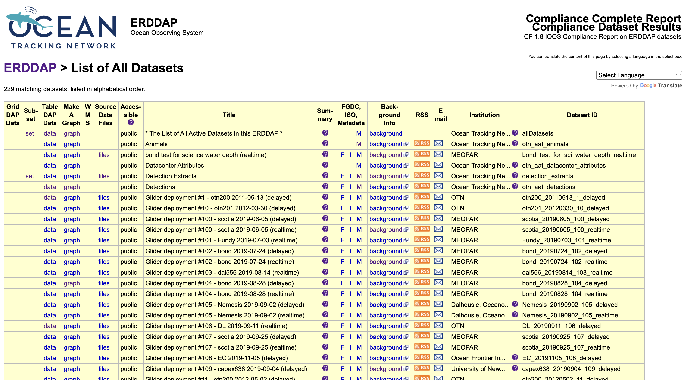
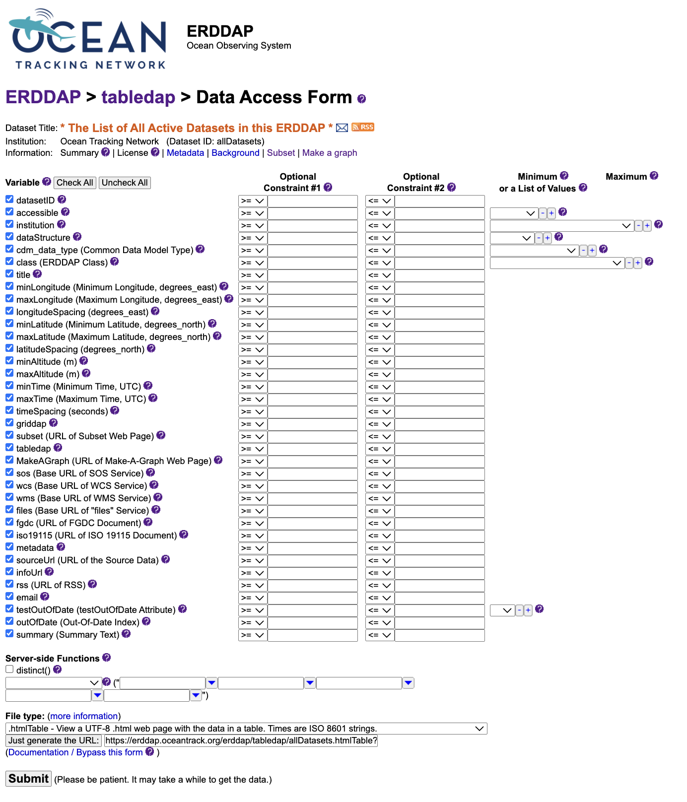
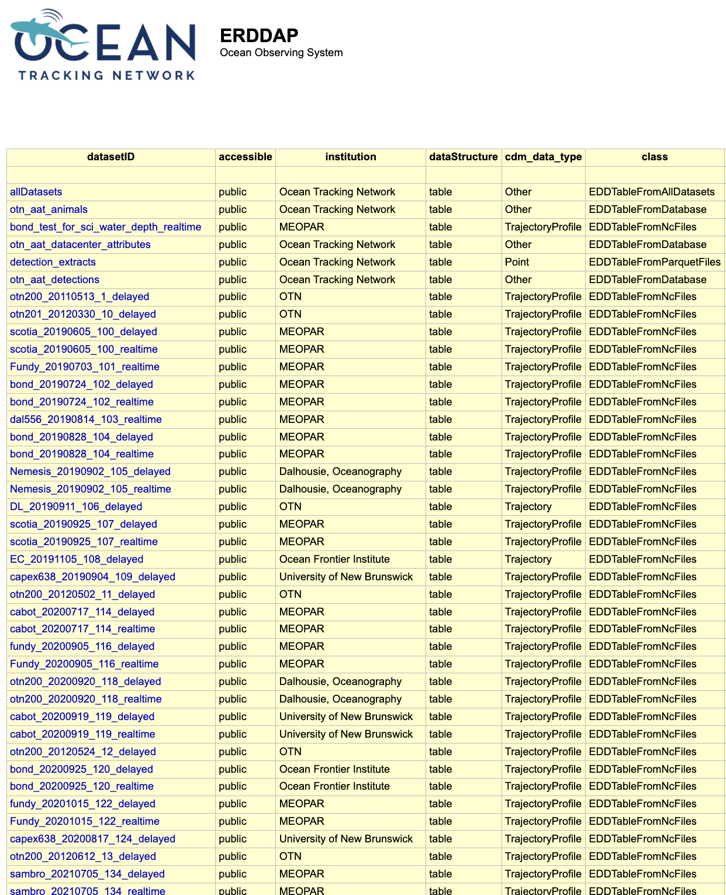

## What is ERDDAP?

ERDDAP (Environmental Research Division’s Data Access Program) is an open-source data server that provides a consistent and flexible way to search, subset, and download scientific data, particularly time-series and tabular datasets. It functions as both a database and a web API, allowing users to define variables, filters, and output formats in their data requests. ERDDAP then delivers the requested data in formats such as CSV, JSON, or NetCDF, which can be directly integrated into analytical tools like R or Python.

Within the Ocean Tracking Network (OTN), ERDDAP is used to publish public time-series and detection datasets, including acoustic animal detections, glider mission data (e.g., temperature and salinity), and mooring or sensor-based time-series. Each dataset has a unique dataset ID (for example, `otn_aat_detections`) and a list of variables such as `time`, `latitude`, `longitude`, `depth`, or `transmitter_id`.

Researchers can use ERDDAP to select specific variables, filter data by time or location, specify the desired output format, and integrate the retrieved data into analytical workflows. ERDDAP serves as OTN’s central data access platform, providing clear and efficient access to information about what happened, where, and when.

## Anatomy of an ERDDAP TableDAP Request

ERDDAP provides table-based access to OTN data through a simple, reproducible URL pattern.

### Basic structure

```text
https://members.oceantrack.org/erddap/tabledap/<dataset_id>.<file_type>?<variables>[&<filters>]
```

{: .language-text}

An ERDDAP URL consists of four components:

| Component     | Description                                 | Example                                                                          |
| ------------- | ------------------------------------------- | -------------------------------------------------------------------------------- |
| Base endpoint | Always begins with `/erddap/tabledap/`      | `https://members.oceantrack.org/erddap/tabledap/`                                |
| Dataset ID    | The specific dataset to query               | `otn_aat_detections`                                                             |
| File type     | Desired output format                       | `.csv`, `.json`, `.nc`                                                           |
| Query         | Variables and filters joined by `?` and `&` | `?time,latitude,longitude&time>=2016-11-01T00:00:00Z&time<=2016-11-16T23:59:59Z` |

Example request:

```text
https://members.oceantrack.org/erddap/tabledap/otn_aat_detections.csv?time,latitude,longitude&time>=2016-11-01T00:00:00Z&time<=2016-11-16T23:59:59Z
```

{: .language-text}

This query instructs ERDDAP to:

* Use the `otn_aat_detections` dataset
* Return results in CSV format
* Include only the columns `time`, `latitude`, and `longitude`
* Restrict rows to detections between 1–16 November 2016

### Choosing variables, filters, and formats

Each ERDDAP dataset lists its available variables and supported filters in the web interface.
Users can select only the variables required and apply constraints such as time ranges, spatial
bounds, or numeric thresholds to limit the results. These filters are applied server-side,
ensuring only the requested subset is downloaded.

Multiple output formats are supported. CSV is commonly used for R or Python workflows,
but JSON, NetCDF (`.nc`), and Parquet are also available for large-scale or cloud-based analyses.
The full list of output options appears at the bottom of the Data Access Form.

### Example query

A live query can be opened directly in a browser:

[https://members.oceantrack.org/erddap/tabledap/otn_aat_detections.csv?time,latitude,longitude&time>=2016-11-01T00:00:00Z&time<=2016-11-16T23:59:59Z](https://members.oceantrack.org/erddap/tabledap/otn_aat_detections.csv?time,latitude,longitude&time>=2016-11-01T00:00:00Z&time<=2016-11-16T23:59:59Z)

Users can modify `.csv` to `.json` or adjust the time range to explore different results.

## Accessing OTN ERDDAP Data in R and Python

### Reading ERDDAP data in R

~~~
# If needed, install:
# install.packages("readr")

library(readr)

# Define the ERDDAP URL
erddap_url <- "https://members.oceantrack.org/erddap/tabledap/otn_aat_detections.csv?time,latitude,longitude&time>=2016-11-01T00:00:00Z&time<=2016-11-16T23:59:59Z"

# Read directly into R as a data frame
detections <- read_csv(erddap_url, show_col_types = FALSE)

# Preview the first few rows
head(detections)
~~~
{: .language-r}

**Explanation**

* `read_csv()` downloads the filtered dataset directly from ERDDAP.
* The server returns only the specified columns and time range.
* The resulting data frame can be used immediately for analysis or visualization.

---

### Reading ERDDAP data in Python

~~~
# If needed, install:
# pip install pandas

import pandas as pd

# Define the ERDDAP URL
erddap_url = (
    "https://members.oceantrack.org/erddap/tabledap/otn_aat_detections.csv?"
    "time,latitude,longitude&"
    "time>=2016-11-01T00:00:00Z&"
    "time<=2016-11-16T23:59:59Z"
)

# Load the data into a pandas DataFrame
detections = pd.read_csv(erddap_url)

# Preview the first few rows
print(detections.head())
~~~
{: .language-python}

**Explanation**

* `pd.read_csv()` retrieves the filtered CSV directly from ERDDAP.
* Variable selection, filtering, and formatting occur on the server side.
* The resulting DataFrame is immediately ready for exploration or analysis.

## Exploring ERDDAP’s Built-in Tools

ERDDAP is not only a data API but also a complete browser-based interface
for exploring, filtering, plotting, and exporting datasets.
Each dataset page includes a set of built-in tools designed for
data access, discovery, and quick validation.

### The ERDDAP Dataset Catalog

When you open the Ocean Tracking Network’s ERDDAP server,
the first page you see is the dataset catalog.
This catalog lists every dataset that is publicly available through the system.

<p align="center">
  
</p>

Each row in this table represents a dataset.
Some are small, such as metadata summaries, while others—like
animal detections or glider missions—contain millions of records collected
over many years of fieldwork.

Each dataset row includes several links that provide different ways to explore the same data.

* The **TableDAP** link opens the *Data Access Form*,
  where you can select variables, apply filters (for example, a date range or location),
  and download a filtered subset.
* The **Make A Graph** link opens a lightweight plotting interface directly on the server.
  It allows you to preview data patterns, such as plotting a glider’s depth through time
  or visualizing detection locations by latitude and longitude.
* The **Files** link, if available, provides access to raw data files,
  typically in NetCDF or CSV format.
* The **Metadata** and **Background Info** links lead to documentation describing
  the dataset, including variable definitions, units, collection methods, licensing,
  and citation details.

Each dataset also has a short **Dataset ID**, such as `otn_aat_detections`
or `otn200_20220912_116_realtime`.
This identifier is used in R, Python, or programmatic queries to specify which dataset
to access.

The catalog is the primary entry point for exploring OTN data.
You can identify the dataset you need, review its metadata, and either
download data directly or copy the generated URL for use in code.

---

### The Data Access Form

Selecting a dataset’s **data** link opens the *Data Access Form*,
an interactive interface for exploring variables, applying filters,
and building precise queries before downloading.

<p align="center" style="display: flex; justify-content: center; gap: 15px;">
  
  
</p>

Each row in the form corresponds to a variable, such as `time`, `latitude`,
`longitude`, or `depth`.
You can check boxes to include variables or enter constraints to limit results
(for example, a specific time window or latitude range).

At the bottom of the form, the **File type** menu controls the format
in which ERDDAP returns data.
CSV (`.csv`) is a common choice for quick analysis,
but JSON (`.json`) or NetCDF (`.nc`) formats work equally well.

When ready, you can either:

* Click **Submit** to run the query and preview results directly in the browser, or
* Choose **Just generate the URL** to create a reusable link encoding
  all selected variables, filters, and output format.

This link can be copied into a browser, R script, or Python notebook
to reproduce the same query at any time.

---

### The “Make A Graph” Tool

The **Make A Graph** option allows you to visualize data on the ERDDAP server
before downloading.

<p align="center">
  
</p>

This tool functions similarly to the Data Access Form but adds a plotting interface.
You can select X and Y variables, apply filters, and preview data as line, scatter,
or depth profile plots.
It is intended for quick data exploration—useful for checking coverage,
identifying trends, or confirming that filters are working as expected.

When you click **Redraw the graph**, ERDDAP generates the plot immediately.
A caption and a direct URL appear below the graph;
this URL reproduces the same visualization and can be shared or reused later.

---

### Other Features in ERDDAP

In addition to the data and graph tools, ERDDAP provides several supporting views
that help users understand datasets in detail.

* The **Metadata** page lists all variables, their units, ranges,
  and data types, as well as global attributes such as license, citation,
  and time coverage.
* The **Background Info** page provides contextual details—
  for example, project origin, instrument type, or links to related documentation.
* The **Files** view (when available) offers complete data archives,
  often in NetCDF, CSV, or Parquet format,
  for users who prefer to download full datasets rather than filtered subsets.

Together, these tools make ERDDAP a comprehensive environment
for data discovery and access.
They allow you to inspect, filter, visualize, and document datasets
directly within the web interface, and then replicate those workflows
programmatically in R or Python.