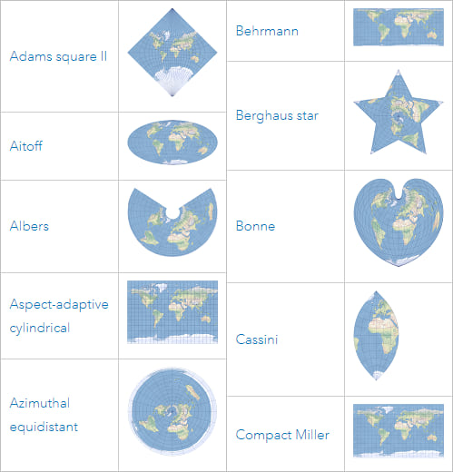

## Introduction

This lesson introduces the basic concepts and practical workflow for working with geospatial data in R, using telemetry-style data as the running example. The intent is to cover both the *definitions* (what spatial data is, what a CRS is) and the *minimum set of operations* you need to correctly map and analyze locations.

The lesson uses two core R packages:

* `sf` for **vector spatial data** (points, lines, and polygons). In telemetry workflows, detections and receiver locations are typically treated as **points**; movement paths can be represented as **lines**; and analysis regions (for example, receiver coverage areas) are often represented as **polygons**.
* `terra` for **raster spatial data** (grids of cells). Rasters are commonly used for environmental layers (for example, depth or temperature surfaces) and are often combined with telemetry points by extracting raster values at point locations.

A large portion of geospatial analysis is deciding how coordinates should be interpreted. For that reason, this lesson emphasizes **coordinate reference systems (CRS)** and how they affect results. Specifically, the lesson covers:

* what spatial data is, and how vector and raster data differ
* how CRSs work (geographic vs projected coordinates, units, and what the CRS metadata represents)
* how to check CRS information in R and how to fix common issues (missing or incorrect CRS)
* how to convert data between CRSs (assigning a CRS when it is known vs transforming to a new CRS)
* an example of when CRS choice matters for analysis (distance/buffering or area calculations), including why you may choose a distance-preserving, area-preserving, or angle-preserving CRS depending on the method

By the end of the lesson, participants will have taken telemetry-style detection and receiver tables, converted them into `sf` objects, transformed them into an appropriate projected CRS for measurement-based analysis, and then used `terra` to work with a raster layer and combine it with the telemetry points through CRS alignment and value extraction.

## Setup

This lesson uses **R** in **RStudio**. Open RStudio and work from an R script (File → New File → R Script) so your code is saved.

We will use:

* `sf` for vector spatial data (points, lines, polygons)
* `terra` for raster spatial data (grids)
* `glatos` for telemetry-oriented workflows and example data structures

### Install packages (run once per computer)

Install `sf` and `terra` from CRAN:

```
install.packages(c("sf", "terra"))
```

{: .language-r}

Install `glatos` from the OTN R-universe repository:

```
options(repos = c(
  otn  = "https://ocean-tracking-network.r-universe.dev",
  CRAN = "https://cloud.r-project.org"
))

install.packages("glatos")
```

{: .language-r}

If you have trouble installing `glatos`, use the workshop installation link/instructions provided by the instructor.

### Load packages (run at the start of each R session)

```
library(sf)
library(terra)
library(glatos)
```

{: .language-r}

### Verify the setup

These commands should return version numbers without errors:

```
packageVersion("sf")
packageVersion("terra")
packageVersion("glatos")
```

{: .language-r}

The detections and receiver datasets used in the exercises will be introduced after the spatial data concepts section.

## Spatial data concepts (vector and raster)

Spatial data (also called geospatial data) is data that includes information about location on the Earth. In practice, spatial datasets usually combine location information (for example, coordinates or boundaries) with attribute data that describes what was observed (for example, a tag ID, receiver ID, detection time, species, or deployment details). ([TechTarget][1])

What makes spatial data different from a regular table is that location can be used directly in analysis. Instead of only asking “how many detections happened,” you can ask questions such as “which detections occurred near a receiver,” “which detections fall inside a study area,” or “how far apart were consecutive detections.” These questions depend on how location is represented and measured. ([TechTarget][1])

Spatial data is commonly represented in two formats: **vector** and **raster**. ([TechTarget][1])

<p align="center">  </p>

**Vector data** represents discrete features as geometries. The main geometry types are points, lines, and polygons. A **point** represents a single location, such as a receiver station or a detection location. A **line** can represent a path or track, such as connecting detections in time order for a single tag. A **polygon** represents an area, such as a study boundary or a buffer region around a receiver. Vector data is most useful when you care about individual features and their relationships (for example, distance to the nearest receiver, whether a point falls inside a polygon, or overlap between areas). ([TechTarget][1])

**Raster data** represents a surface as a grid of cells. Each cell stores a value, such as temperature, depth, chlorophyll, or elevation. Raster data is often used for continuous variables that change across space. Key raster properties are the **extent** (the area covered), **resolution** (cell size), and the coordinate reference system used to locate the grid on the Earth. Higher resolution (smaller cells) increases spatial detail but also increases data size and computation time. ([TechTarget][1])

In an ocean monitoring context, a typical workflow uses both types. Detections and receivers are naturally represented as **vector points**, while environmental context (for example, depth or sea surface temperature) is often represented as a **raster**. A common task is to attach raster values to detection points (for example, “what was the raster value at each detection location?”), which requires that both datasets use compatible coordinate reference systems. ([TechTarget][1])

> ## Vector vs raster Challenge
>
> For each item below, decide whether it is vector or raster. If vector, specify point, line, or polygon.
>
> 1. Receiver station locations (one coordinate pair per receiver)
>
> 2. Detection locations (one coordinate pair per detection record)
>
> 3. A path connecting detections in time order for one tag
>
> 4. A buffer zone drawn around each receiver
>
> 5. A gridded depth or temperature layer
>
> > ## Solution
> >
> > 1. Vector (point)
> > 2. Vector (point)
> > 3. Vector (line)
> > 4. Vector (polygon)
> > 5. Raster
> >    {: .solution}
> >    {: .challenge}


## Example data (detections and deployments)

For this lesson, we will use the example detections and deployments CSV files that ship with `glatos`. `system.file()` is used to locate files that are included inside an installed package.

```
det_csv <- system.file("extdata", "blue_shark_detections.csv", package = "glatos")
dep_csv <- system.file("extdata", "hfx_deployments.csv",      package = "glatos")

detections  <- read.csv(det_csv)
deployments <- read.csv(dep_csv)
```

{: .language-r}

### What these datasets represent

`detections` contains detection records. Each row represents one detection event and includes both identifying information (for example, the tag name and receiver/station fields) and metadata such as detection time.

`deployments` contains receiver station deployment information. Each row represents a receiver station record and includes station identifiers and location fields.

These example datasets include many columns that are not required for the geospatial parts of this lesson. For the next sections, the only fields we must have are:

* detection coordinates (longitude and latitude)
* receiver/station coordinates (longitude and latitude)
* a tag identifier (to allow filtering to one animal/tag for plotting)

Other columns (for example, depth fields, receiver model fields, notes) are retained because they are often useful in real projects, but they are not required for creating spatial objects.

### Identify key columns

Check the column names:

```
names(detections)
names(deployments)
```

{: .language-r}

For these example datasets, the coordinate columns are:

* In `detections`: `decimalLongitude` and `decimalLatitude`
* In `deployments`: `stn_long` and `stn_lat`

A useful identifier column in `detections` is `tagName` (this will be used later to subset detections for one tag).

`detections` also contains a column called `geometry`. For this lesson, we will create spatial objects using the longitude/latitude columns so the workflow is explicit and consistent.

In the next section, we will convert these tables into sf objects so R understands the coordinates as spatial geometries and we can use spatial operations (plotting, CRS checks, distance/buffer operations).

## Vector spatial data with `sf` (creating point objects)

The `sf` package is the standard way to represent **vector spatial data** in R. An `sf` object is a regular table (data frame) with an additional **geometry** column that stores spatial features (points, lines, or polygons). Once data is stored as an `sf` object, R can treat it as spatial: you can plot it as a map layer, check and assign coordinate reference systems (CRS), transform between CRSs, and use spatial operations such as distance, buffering, and spatial joins.

At the moment, `detections` and `deployments` are regular tables. Even though they contain coordinate columns (and `detections` has a column named `geometry`), R does not automatically treat the rows as spatial features. In this section, we will explicitly create point geometries from longitude and latitude and store them as `sf` objects.

### Create `sf` point objects

```
# Detections as sf points ####
detections_sf <- st_as_sf(
  detections,
  coords = c("decimalLongitude", "decimalLatitude"),
  remove = FALSE
)

# Deployments (receiver stations) as sf points ####
deployments_sf <- st_as_sf(
  deployments,
  coords = c("stn_long", "stn_lat"),
  remove = FALSE
)

# Check the result ####
class(detections_sf)
class(deployments_sf)

st_geometry(detections_sf)[1:3]
st_geometry(deployments_sf)[1:3]
```

{: .language-r}

At this point, both objects have a geometry column, but they do not yet have a CRS assigned. The CRS step is covered in the next section.

### Quick plot

```
plot(st_geometry(deployments_sf),
     pch = 16, cex = 0.8, asp = 1,
     main = "Receiver deployments and detections")

plot(st_geometry(detections_sf),
     pch = 16, cex = 0.5,
     add = TRUE)
```
{: .language-r}

The plot shows the receiver deployment locations (first layer) with detections overlaid on top (second layer). Both layers are being drawn using only their point geometries. At this stage, the objects do not have a coordinate reference system (CRS) assigned (CRS: NA), but the numeric values indicate these are longitude/latitude coordinates (negative longitudes and latitudes around ~44°). In the next section, a CRS will be assigned so the coordinates are formally defined and can be transformed when needed.

Because there can be many detections at the same receiver station, multiple points may overlap exactly. When many points overlap, they can appear as darker or thicker marks. The overall footprint of points should still fall in the same general region for deployments and detections; if they do not overlap geographically, that is often the first sign that coordinates or CRS metadata are incorrect.

> ## Creating sf points Challenge
>
> 1. Run the code above to create `detections_sf` and `deployments_sf`.
>
> 2. Use `names(detections_sf)` to confirm the coordinate columns are still present (because `remove = FALSE`).
>
> 3. Plot the two layers and confirm they appear in the same general area.
>
> > ## Solution
> >
> > A correct result is that both objects print as `sf` objects, `names()` still lists the longitude/latitude columns, and the plot shows detections and deployments in overlapping geographic space.
> > {: .solution}
> > {: .challenge}


## Coordinate reference systems (CRS)

A **coordinate reference system (CRS)** is a GIS definition that specifies how coordinate values correspond to locations on Earth. CRS information is required to place spatial data correctly on a map and to align multiple spatial layers.

A CRS definition typically includes:

* a **datum** (the reference surface used to model the Earth)
* a **coordinate system** (how positions are expressed, such as longitude/latitude or a planar grid)
* **units** (for example, degrees or meters)
* if projected, a **map projection** (the mathematical transformation from the Earth to a flat map)

CRS choice affects measurement. Geographic coordinates in degrees are convenient for storing and sharing locations, but distance and area calculations generally require a projected CRS with linear units. Map projections introduce distortion, so different projections preserve different properties (for example, area, angles, or distance) more effectively over a given region. For telemetry workflows, it is common to keep raw locations in longitude/latitude and transform to a meter-based projected CRS before distance-based operations (buffers, nearest receiver, movement distances) and many area-based calculations.

### Geographic vs projected CRS

* **Geographic CRS (longitude/latitude)**: coordinates are angles in **degrees** (e.g., **WGS84 / EPSG:4326**).
* **Projected CRS**: coordinates are in **linear units** (commonly **meters**) defined by a projection (e.g., **UTM** zones).

For the Halifax-area example data in this lesson, we will use **WGS84 / UTM zone 20N (EPSG:32620)** as a practical projected CRS for distance calculations.

### Assigning vs transforming CRS in `sf`

Two different CRS operations are used in practice:

* **Assign a CRS** when the CRS is known but missing from the object. This adds CRS metadata and does **not** change coordinate values.
* **Transform to a new CRS** to represent the same locations in a different coordinate system. This changes coordinate values while keeping locations the same.

In `sf`:

* `st_set_crs()` assigns CRS metadata
* `st_transform()` transforms (reprojects) to a new CRS

---

### Check CRS metadata

We created point geometries earlier; check whether CRS metadata is present:

```
st_crs(detections_sf)
st_crs(deployments_sf)
```

{: .language-r}

If CRS is missing, `st_crs()` will return `NA`.

### Assign WGS84 (EPSG:4326)

The example `glatos` coordinates are longitude/latitude in degrees, so assign **WGS84 (EPSG:4326)**:

```
detections_sf  <- st_set_crs(detections_sf, 4326)
deployments_sf <- st_set_crs(deployments_sf, 4326)

st_crs(detections_sf)
st_crs(deployments_sf)
```

{: .language-r}

### Transform to a projected CRS (meters)

Transform to a projected CRS for distance-based work. Here we use **UTM zone 20N (EPSG:32620)**:

```
detections_utm  <- st_transform(detections_sf, 32620)
deployments_utm <- st_transform(deployments_sf, 32620)

st_crs(detections_utm)
st_crs(deployments_utm)
```

{: .language-r}

---

> ## CRS workflow Challenge
>
> 1. Use `st_crs()` to confirm `detections_sf` and `deployments_sf` have missing CRS metadata (`NA`) before assignment.
> 2. Assign EPSG:4326 to both objects with `st_set_crs()`.
> 3. Transform both objects to EPSG:32620 with `st_transform()`.
> 4. Plot the projected layers and confirm they still overlap.
>
> ```
> plot(st_geometry(deployments_utm),
>      pch = 16, cex = 0.8, asp = 1,
>      main = "Deployments and detections (UTM, meters)")
>
> plot(st_geometry(detections_utm),
>      pch = 16, cex = 0.5,
>      add = TRUE)
> ```
>
> {: .language-r}
>
> > ## Solution
> >
> > A correct result is:
> >
> > * EPSG:4326 is assigned to `detections_sf` and `deployments_sf`.
> > * EPSG:32620 is shown for `detections_utm` and `deployments_utm`.
> > * The projected plot shows the same spatial pattern as the geographic plot.
> >   {: .solution}
> >   {: .challenge}


## When CRS choice matters (distance vs area vs angles)

Projection choice matters when your method depends on measuring something (distance, area, direction), not just drawing a map. A projected CRS converts locations from a longitude/latitude description on a globe into a flat coordinate system where measurements behave in specific ways. Because flattening the Earth introduces distortion, different projections are designed to preserve different properties (and no single projection preserves everything equally well everywhere).

<p align="center">
  
</p>

### What to preserve depends on the analysis

* **Distance-based methods** (buffers, nearest-receiver distance, step lengths) require a CRS with **linear units** (typically meters) and reasonable distance behavior over your study region (often a local UTM zone).
* **Area-based methods** (polygon area, habitat area summaries, home-range area outputs) should use an **equal-area** projection so computed areas are comparable.
* **Angle/bearing methods** (movement direction, headings, angle-based comparisons) are best supported by an **angle-preserving (conformal)** projection, which preserves local angles.

In this lesson, we demonstrate the distance case with a 5 km receiver buffer. This provides a concrete example of why we transformed from longitude/latitude (degrees) to a projected CRS (meters) in the previous section.

---

### Distance example: detections within 5 km of a receiver

This example answers:

> “For one tag, how many detections occurred within 5 km of at least one receiver station?”

This requires meter units, so it uses `deployments_utm` and `detections_utm`.

#### Create 5 km buffers around receiver stations

```
# 5 km = 5000 meters (requires projected CRS with meter units)
receiver_buf_5km <- st_buffer(deployments_utm, dist = 5000)
```

{: .language-r}

#### Subset detections to one tag

```
# Use one tag to keep results and plots manageable
tag_id  <- detections_utm$tagName[1]
one_tag <- detections_utm[detections_utm$tagName == tag_id, ]
```

{: .language-r}

#### Count detections inside any buffer

`st_intersects()` returns which buffers each detection intersects. If a detection intersects at least one buffer, it is within 5 km of a receiver.

```
inside_any <- lengths(st_intersects(one_tag, receiver_buf_5km)) > 0

sum(inside_any)   # detections within 5 km of >= 1 receiver
nrow(one_tag)     # total detections for this tag
```

{: .language-r}

#### Plot buffers and detections

```
plot(st_geometry(receiver_buf_5km), col = NA, border = "grey40",
     main = "Detections within 5 km of receivers (UTM, one tag)")

plot(st_geometry(one_tag), pch = 16, cex = 0.6, add = TRUE)
```

{: .language-r}

---

> ## Distance and projection choice Challenge
>
> 1. Create 5 km buffers around receivers using `deployments_utm`.
>
> 2. Subset `detections_utm` to a single `tagName`.
>
> 3. Use `st_intersects()` to count how many detections are within 5 km of at least one receiver.
>
> 4. Make the plot showing buffers and detections.
>
> > ## Solution
> >
> > A correct result is:
> >
> > * `sum(inside_any)` returns a count between 0 and `nrow(one_tag)`.
> > * The plot shows detection points overlaid on the receiver buffers.
> > * This workflow uses the projected `*_utm` objects so the buffer distance is interpreted in meters.
> >   {: .solution}
> >   {: .challenge}

---

### Notes

This section demonstrates a common reason to transform CRS in telemetry workflows: distance thresholds (for example, “within 5 km”) require a projected CRS with linear units. The same decision rule applies to other methods: use an equal-area CRS when area is the target metric, and use an angle-preserving CRS when bearings or angle relationships are central to the analysis.

## Raster spatial data with `terra`

A **raster** is spatial data stored as a grid. The study area is divided into equal-sized cells, and each cell stores a value. That value can represent a continuous variable (for example, depth or temperature) or a category (for example, habitat class). Rasters are widely used for environmental and remote-sensing products because they represent conditions across an entire area, not just at a set of sampled locations.

In contrast, **vector data** (what we used with `sf`) represents discrete features as points, lines, and polygons. In this lesson’s telemetry context:

* **Vector (`sf`)**: detections and receiver stations as **points**, and derived features like **buffers** as polygons.
* **Raster (`terra`)**: environmental layers such as **bathymetry (seafloor depth)**, **sea surface temperature**, or **chlorophyll**.

### What a raster “means” in practice

A raster value is tied to a specific cell location and cell size. When you use a raster in analysis, you are working at the raster’s resolution: values represent conditions at the scale of the cell. Many rasters also include **NoData** cells (missing values), for example where a dataset has no coverage or where land/water masks remove values.

Some rasters have one layer (one value per cell). Others have multiple layers (often called **bands**). For example:

* satellite imagery commonly has multiple bands (different wavelengths)
* environmental datasets may have multiple layers for different variables or time steps

### Core raster properties

Three properties determine how a raster lines up with other spatial data and how detailed it is:

* **Extent**: the area covered by the raster.
* **Resolution (cell size)**: the size of each cell. Smaller cells give more spatial detail but increase file size and computation time.
* **CRS**: how the raster grid is positioned on Earth.

If you want a deeper overview of raster concepts and raster properties (extent, resolution, CRS, bands, NoData), see the ArcGIS Pro documentation: https://pro.arcgis.com/en/pro-app/latest/help/data/imagery/introduction-to-raster-data.htm
 and https://pro.arcgis.com/en/pro-app/latest/help/data/imagery/raster-dataset-properties.htm

### The key raster–point operation: extraction

A common workflow is to attach raster values to point locations:

> For each detection point, return the raster value at that location.

This is called **extraction**. After extraction, your detection points gain a new column (for example `depth_m`), which you can summarize, plot, or use in later analysis.

### Example raster layer for this lesson: bathymetry

We will use a bathymetry raster (seafloor depth) because it is a common ocean layer and it pairs naturally with detection locations. The same `terra` workflow applies to other rasters (for example temperature): load the raster, ensure CRS compatibility, then extract values at point locations.

### Extract depth values at detection points

This example uses a depth (bathymetry) GeoTIFF. Download the bathymetry_raster.tiff from the workshop GitHub repository: 

#### Load the raster and check its spatial information

```
depth_raster <- rast("data/bathymetry_raster.tiff")

ext(depth_raster)  # area covered
res(depth_raster)  # cell size
crs(depth_raster)  # CRS
```

{: .language-r}

#### Subset detections to one tag

```
tag_id  <- detections_sf$tagName[1]
one_tag <- detections_sf[detections_sf$tagName == tag_id, ]
```

{: .language-r}

#### Match CRS (if needed) and extract values

```
if (st_crs(one_tag)$wkt != crs(depth_raster)) {
  one_tag <- st_transform(one_tag, crs(depth_raster))
}

one_tag$depth_m <- extract(depth_raster, vect(one_tag))[, 2]
head(one_tag[, c("tagName", "depth_m")])
```

{: .language-r}

#### Quick plot (optional)

```
plot(depth_raster, main = "Depth raster + detections (one tag)")
plot(st_geometry(one_tag), pch = 16, cex = 0.6, add = TRUE)
```

{: .language-r}

> ## Raster extraction Challenge
>
> 1. Load `data/bathymetry_raster.tiff` as a raster using `rast()`.
>
> 2. Subset `detections_sf` to one `tagName`.
>
> 3. If needed, transform the points to match the raster CRS.
>
> 4. Use `extract()` to create a `depth_m` column.
>
> > ## Solution
> >
> > A correct result is that `one_tag$depth_m` contains numeric values (not all `NA`) and `head(one_tag[, c("tagName","depth_m")])` prints depth values for the first few detections.
> > {: .solution}
> > {: .challenge}

